scRNA-seq Analysis with Seurat
================
Arash Soltani, PhD
2025-08-20

### ***Single-Cell RNA-Seq Analysis of Colorectal Cancer (GSE231559)***

#### ***Overview***

This repository contains an R-based analysis pipeline for single-cell
RNA-sequencing (scRNA-seq) data from the GSE231559 dataset, part of the
MD Anderson Cancer Center CRC Moon Shot project. The analysis focuses on
preprocessing, quality control, normalization, integration, clustering,
and cell type annotation using the Seurat package. For practical
scRNA-seq analysis, I relied on the comprehensive tutorial developed by
the [Harvard Chan Bioinformatics Core](https://github.com/hbctraining)
and [Quantitative Developmental Biology
Lab](https://github.com/quadbio).

The dataset is publicly available on [GEO (accession:
GSE231559)](https://www.ncbi.nlm.nih.gov/geo/query/acc.cgi?acc=GSE231559)
and was published on September 25, 2023.

#### Install packages

``` r
# install.packages("Seurat")
# install.packages("tidyverse")
# install.packages("BiocManager")
# install.packages("qs")
# install.packages("AnnotationHub")
# install.packages("patchwork")
```

## Step 0. **Load libraries and create directories**

``` r
library(Seurat)
library(tidyverse)
library(patchwork)
library(Matrix)
```

Create directories

``` r
# Create necessary directories for data, plots, and results if they don't already exist

if (!dir.exists("data")) {dir.create("data")}

plots_dir <- "plots"
if (!dir.exists(plots_dir)) {dir.create(plots_dir)}

results_dir <- "results"
if (!dir.exists(results_dir)) {dir.create(results_dir)}
```

``` r
# Create a standardized plotting function
save_png <- function(p, 
                     filename, 
                     width = 16, 
                     height = 8.135, 
                     res = 300, 
                     units = "in") {
  png(filename = filename, width = width, height = height, units = units, res = res)
  print(p)  
  invisible(dev.off())
}
```

## **Step 1. Create a Seurat objects for each sample**

``` r
file_paths <- list.files("GSE231559/", full.names = TRUE)

for (i in file_paths) {
  name <- basename(i)
  print(paste0("Processing: ", name))
  se <- Read10X(data.dir = i)
  seurat_obj <- CreateSeuratObject(counts = se, 
                                   min.cells = 5,
                                   min.features = 250, 
                                   project = name)
  

  assign(name, seurat_obj)
}
```

    ## [1] "Processing: GSM7290762"
    ## [1] "Processing: GSM7290763"
    ## [1] "Processing: GSM7290768"
    ## [1] "Processing: GSM7290769"
    ## [1] "Processing: GSM7290771"
    ## [1] "Processing: GSM7290772"
    ## [1] "Processing: GSM7290773"
    ## [1] "Processing: GSM7290774"
    ## [1] "Processing: GSM7290777"

## **2. Merge all Seurat objects**

``` r
# merge Seurat objects
merged_se <- merge(x = GSM7290762, 
                    y = c(GSM7290768, GSM7290771, GSM7290777, 
                          GSM7290769, GSM7290763, GSM7290772,
                          GSM7290773,  GSM7290774), 
                    add.cell.id = c(paste0(rep('norm', 3), 
                                           c(62, 68, 71)), 
                                    paste0(rep('tumor', 6), 
                                           c(77, 69, 63, 72:74))))
```

## **3. Quality control (QC)**

``` r
# Add number of genes per UMI for each cell to metadata
merged_se$log10GenesPerUMI <- log10(merged_se$nFeature_RNA) / log10(merged_se$nCount_RNA)
head(merged_se@meta.data)
```

    ##                           orig.ident nCount_RNA nFeature_RNA log10GenesPerUMI
    ## norm62_AAACCCAAGAGAGCCT-1 GSM7290762       3663          688        0.7962173
    ## norm62_AAACCCAAGTCCCGAC-1 GSM7290762      11289         1807        0.8036603
    ## norm62_AAACCCACATTAAGCC-1 GSM7290762       2682          995        0.8743938
    ## norm62_AAACCCATCACCTTAT-1 GSM7290762       4931         1649        0.8711826
    ## norm62_AAACCCATCGGATACT-1 GSM7290762       2695          769        0.8412409
    ## norm62_AAACGAAAGCCAGAGT-1 GSM7290762       1690          590        0.8584106

Mitochondrial genes come from dying cells. High % of mitochondrial RNA =
Possible dead or stressed cells

``` r
# Compute percent mito ratio
merged_se$mitoRatio <- PercentageFeatureSet(object = merged_se, pattern = "^MT-")
merged_se$mitoRatio <- merged_se@meta.data$mitoRatio / 100

head(merged_se@meta.data)
```

    ##                           orig.ident nCount_RNA nFeature_RNA log10GenesPerUMI
    ## norm62_AAACCCAAGAGAGCCT-1 GSM7290762       3663          688        0.7962173
    ## norm62_AAACCCAAGTCCCGAC-1 GSM7290762      11289         1807        0.8036603
    ## norm62_AAACCCACATTAAGCC-1 GSM7290762       2682          995        0.8743938
    ## norm62_AAACCCATCACCTTAT-1 GSM7290762       4931         1649        0.8711826
    ## norm62_AAACCCATCGGATACT-1 GSM7290762       2695          769        0.8412409
    ## norm62_AAACGAAAGCCAGAGT-1 GSM7290762       1690          590        0.8584106
    ##                           mitoRatio
    ## norm62_AAACCCAAGAGAGCCT-1 0.6300846
    ## norm62_AAACCCAAGTCCCGAC-1 0.5290991
    ## norm62_AAACCCACATTAAGCC-1 0.1689038
    ## norm62_AAACCCATCACCTTAT-1 0.1608193
    ## norm62_AAACCCATCGGATACT-1 0.1124304
    ## norm62_AAACGAAAGCCAGAGT-1 0.3692308

``` r
# Create metadata dataframe
metadata <- merged_se@meta.data
```

``` r
# Add cell IDs to metadata
metadata$cells <- rownames(metadata)
```

``` r
# Create sample column 
metadata <- metadata %>%
  mutate(sample = case_when(
    str_detect(cells, "^norm") ~ "normal",
    str_detect(cells, "^tumor") ~ "tumor",
    TRUE ~ NA_character_  # explicit NA for non-matches
  ))
```

``` r
# Check the distribution
table(metadata$sample)
```

    ## 
    ## normal  tumor 
    ##  13674  29823

``` r
# Rename columns
metadata <- metadata %>%
  dplyr::rename(nUMI = nCount_RNA,
                nGene = nFeature_RNA)
```

``` r
# Add metadata back to Seurat object
merged_se@meta.data <- metadata
```

``` r
p <- VlnPlot(merged_se, features = c("nGene", "nUMI", "mitoRatio"), ncol = 3)
p
```

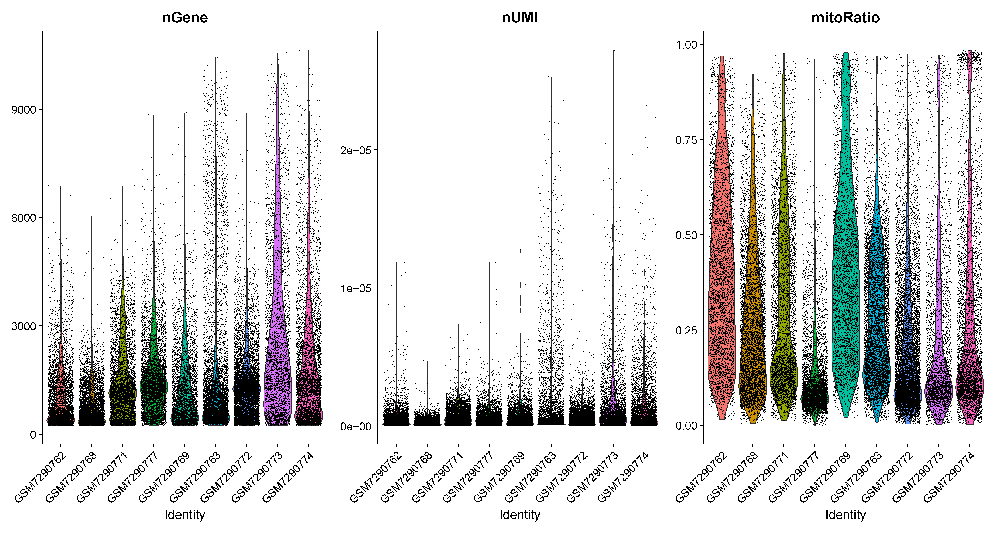

``` r
save_png(p, "plots/QC_VlnPlot_nUMI_mitoR_nGene.png", width = 12, height = 6, res = 300)
```

``` r
p1 <- FeatureScatter(merged_se, feature1 = "nUMI", feature2 = "mitoRatio") + NoLegend()
p2 <- FeatureScatter(merged_se, feature1 = "nUMI", feature2 = "nGene")
p <- p1 + p2 + plot_layout(widths = c(1, 1.3))
p
```

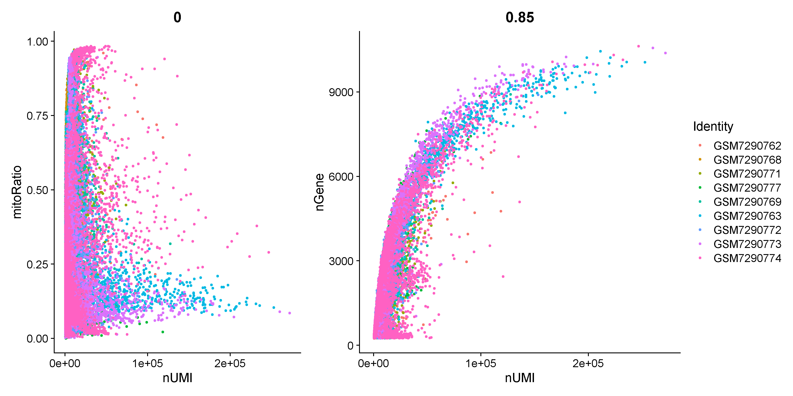

``` r
save_png(p, "plots/QC_Scatter_nUMI_mitoRatio_nGene.png", width = 12, height = 6, res = 300)
```

``` r
# Visualize the overall complexity of the gene expression by visualizing the genes detected per UMI (novelty score)
p <- merged_se@meta.data %>% ggplot(aes(x = log10GenesPerUMI, fill = sample)) +
  geom_density(alpha = 0.5) +
  scale_fill_manual(values = c("normal" = "#909100", "tumor" = "#BdB"), name = "Condition") +
  geom_vline(xintercept = 0.8, linetype = "dashed") +
  facet_wrap(~orig.ident, scales = "free_y") +
  theme_classic() +
  labs(
    title = "Novelty Score by Sample",
    x = "log10(Genes per UMI)",
    y = "Density"
  )
p
```

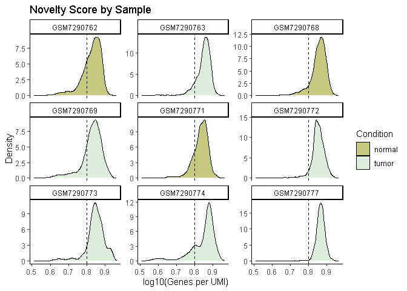

``` r
save_png(p, "plots/Novelty_by_Sample.png", width = 9, height = 8, res = 300)
```

``` r
# Visualize the distribution of mitochondrial gene expression detected per cell
p <- merged_se@meta.data %>% ggplot(aes(x = mitoRatio, fill = sample)) +
  geom_density(alpha = 0.5) +
  scale_x_log10(labels = scales::percent_format(scale = 100, accuracy = 0.1)) +
  scale_fill_manual(values = c("normal" = "#909100", "tumor" = "#BdB")) +
  geom_vline(xintercept = 0.2, linetype = "dashed") +
  facet_wrap(~orig.ident, scales = "free_y") +
  theme_classic() +
  labs(title = "Mito Ratio by Sample", x = "Mito Ratio (%)", y = "Density")

p
```

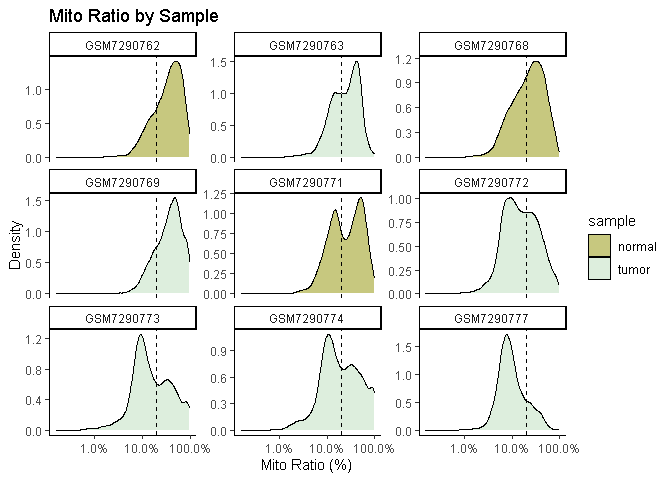

``` r
save_png(p, "plots/mito_bySample.png", width = 9, height = 8, res = 300)
```

``` r
# Visualize the correlation between genes detected and number of UMIs and determine whether strong presence of cells with low numbers of genes/UMIs

p <- merged_se@meta.data %>% 
  ggplot(aes(x=nUMI, y=nGene, color=mitoRatio)) + 
  geom_point(size = 0.5, alpha = 0.6) + 
  scale_colour_gradientn(colours = c("#BdB", "#909100", "black")) +
  geom_smooth(method = "lm", aes(group = orig.ident), 
              color = "red", se = TRUE) +
  scale_x_log10() + 
  scale_y_log10() + 
  theme_classic(base_size = 12) +
  theme(strip.background = element_blank(),
        strip.text = element_text(size = 10)) +
  geom_vline(xintercept = 1000, 
             linetype = "dashed", 
             color = "gray50") +
  geom_hline(yintercept = 500, 
             linetype = "dashed", 
             color = "gray50") +
  facet_wrap(~orig.ident, scales = "free")

p
```

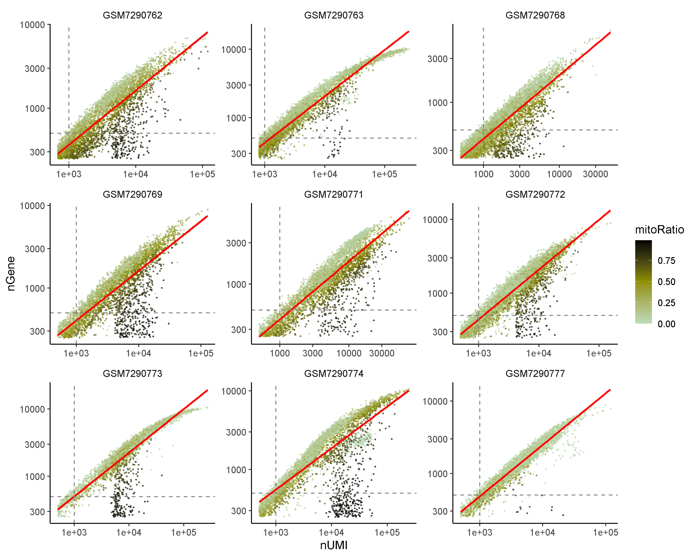

``` r
save_png(p, "plots/correlation_nGene_UMIs_before.png", width = 9, height = 8, res = 300)
```

### **Filtering**

#### *a. Cell-level filtering*

``` r
summary(merged_se@meta.data$nUMI)
```

    ##    Min. 1st Qu.  Median    Mean 3rd Qu.    Max. 
    ##     493    1502    3845    8040    7597  271971

``` r
summary(merged_se@meta.data$nGene)
```

    ##    Min. 1st Qu.  Median    Mean 3rd Qu.    Max. 
    ##     247     510    1100    1495    1786   10626

``` r
summary(merged_se@meta.data$log10GenesPerUMI)
```

    ##    Min. 1st Qu.  Median    Mean 3rd Qu.    Max. 
    ##  0.5114  0.8281  0.8543  0.8460  0.8762  0.9655

``` r
summary(merged_se@meta.data$mitoRatio)
```

    ##    Min. 1st Qu.  Median    Mean 3rd Qu.    Max. 
    ##  0.0000  0.1037  0.2074  0.2761  0.3991  0.9834

``` r
# Filter out low-quality cells using selected thresholds
seurat <- subset(merged_se, 
                 subset = (nUMI >= 1000) &
                   (nGene >= 200) &
                   (nGene <= 8000) &
                   (log10GenesPerUMI > 0.80) & 
                   (mitoRatio < 0.2))
```

#### *b. Gene-level filtering*

``` r
# Merge all layers into a single "counts" slot
merged_counts <- JoinLayers(seurat)  
# Extract counts
counts <- GetAssayData(merged_counts, layer = "counts")

nonzero <- counts > 0

keep_genes <- Matrix::rowSums(nonzero) >= 10

filtered_counts <- counts[keep_genes, ]

# Reassign to filtered object
seurat <- CreateSeuratObject(filtered_counts, meta.data = seurat@meta.data)
```

#### *Re-assess QC metrics*

``` r
# Save filtered subset to new metadata
metadata_clean <- seurat@meta.data

# to see a drop in filtering cells:
met_before <- data.frame(unclass(table(merged_se@meta.data$orig.ident)))
met_before$QCgroup <- "before"
met_before$cell<- rownames(met_before)
names(met_before)[1] <- 'count'

met_after <- data.frame(unclass(table(metadata_clean$orig.ident)))
met_after$QCgroup <- "after"
met_after$cell<- rownames(met_after)
names(met_after)[1] <- 'count'
# count
cell_count <- data.frame(rbind(met_before, met_after))

                                
# visualization :
p <- cell_count %>% 
  ggplot(aes(x=cell, y=count, fill=QCgroup)) + 
  geom_bar(stat="identity", position = position_dodge(width = 0.8), color = "black") +
  theme_classic() +
  theme(axis.text.x = element_text(angle = 45, vjust = 1, hjust=1)) +
  theme(plot.title = element_text(hjust=0.5, face="bold")) +
  scale_fill_manual(values = c("#909100", "#BdB")) +
  xlab("samples") +
  ggtitle("nCells count before and after QC")

p
```

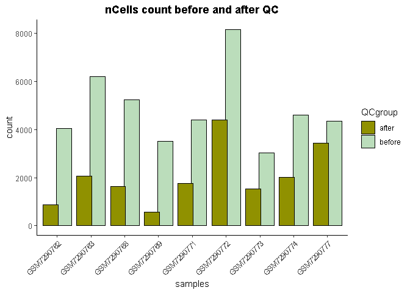

``` r
save_png(p, "plots/correlation_nGene_UMIs_before.png", width = 9, height = 8, res = 300)
```

``` r
# Visualize the correlation between genes detected and the number of UMIs and determine whether the strong presence of cells with low numbers of genes/UMIs

p <- metadata_clean %>% 
  ggplot(aes(x=nUMI, y=nGene, color=mitoRatio)) + 
  geom_point(size = 0.5, alpha = 0.6) + 
  scale_colour_gradientn(colours = c("#BdB", "#909100", "black")) +
  geom_smooth(method = "lm", aes(group = orig.ident), 
              color = "red", se = TRUE) +
  scale_x_log10() + 
  scale_y_log10() + 
  theme_classic(base_size = 12) +
  theme(strip.background = element_blank(),
        strip.text = element_text(size = 10)) +
  geom_vline(xintercept = 1000, 
             linetype = "dashed", 
             color = "gray50") +
  geom_hline(yintercept = 500, 
             linetype = "dashed", 
             color = "gray50") +
  facet_wrap(~orig.ident, scales = "free")

p
```

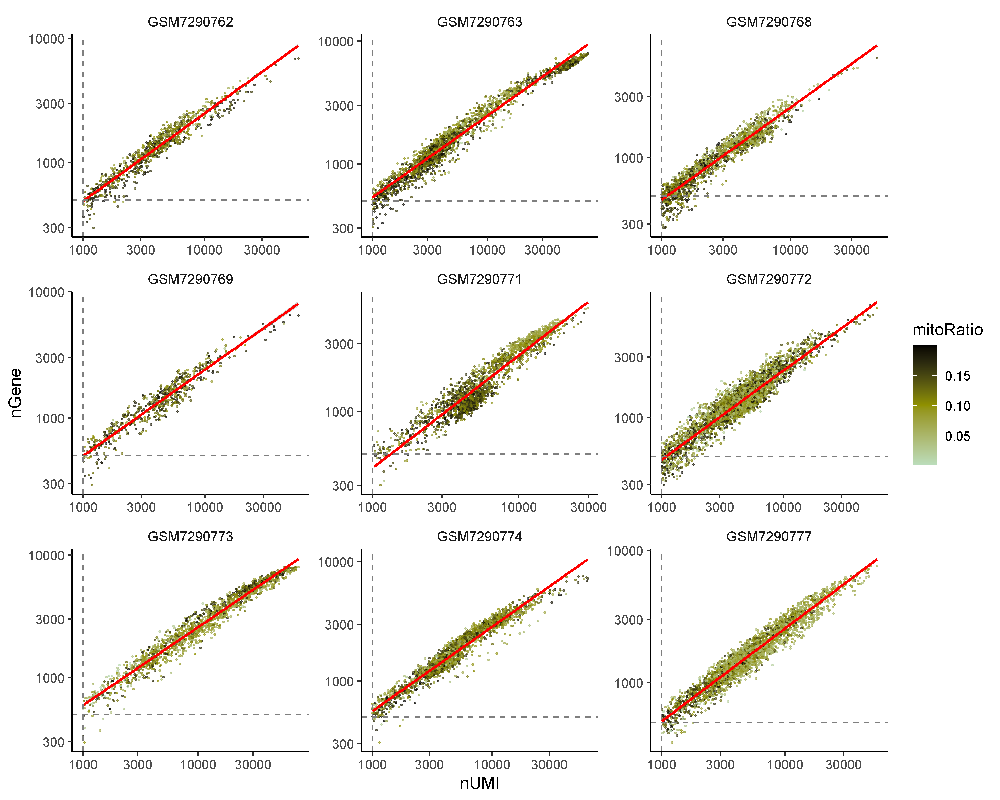

``` r
save_png(p, "plots/correlation_nGene_UMIs_after.png", width = 9, height = 8, res = 300)
```

#### *Saving filtered Seurat object*

## **Step 4. Normalization**

``` r
# Normalization
seurat <- NormalizeData(seurat, 
                              normalization.method = "LogNormalize", 
                              scale.factor = 10000)


load("data/cycle.rda")

# Score cells for cell cycle
seurat <- CellCycleScoring(
  seurat, 
  g2m.features = g2m_genes, 
  s.features = s_genes
)

# View cell cycle scores and phases assigned to cells 
table(seurat$Phase)
```

    ## 
    ##    G1   G2M     S 
    ## 11487  2850  3940

## **Step 4. Feature selection for following heterogeneity analysis**

To perform PCA, we need to **first choose the most variable features,
then scale the data**.

``` r
# Feature selection - Identify the most variable genes
seurat <- FindVariableFeatures(seurat, 
                     selection.method = "vst",
                     nfeatures = 2000, 
                     verbose = FALSE)


# Identify the 10 most highly variable genes
top10 <- head(VariableFeatures(seurat), 10)

# plot variable features with and without labels
p1 <- VariableFeaturePlot(seurat)
p2 <- LabelPoints(plot = p1, points = top10, repel = TRUE)
p2
```

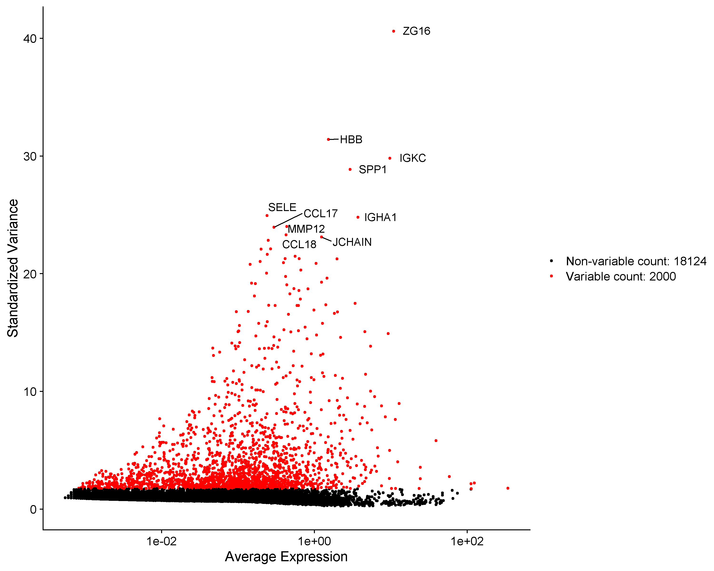

``` r
save_png(p2, "plots/variable_features.png", width = 9, height = 8, res = 300)
```

``` r
# Layout setup
layout(matrix(c(1,2,1,3,1,4),2), widths=c(2,5,1), heights=c(1,9))
par(mar=rep(0,4), mgp=2:0)
plot.new()
title("Cell cycle phase assignment confidence, library sizes, and distribution per sample", line=-2, cex.main=1.5)

# 1. Boxplot of S.Score/G2M.Score confidence per phase
par(mar=c(3,3,1,1), bty="n")
boxplot(split(seurat$S.Score, seurat$Phase),
        col=colorspace::qualitative_hcl(3, alpha=.7, palette="Dark 3"),
        ylab="S phase score")

# 2. Density of library sizes by phase
par(mar=c(3,3,1,1))
cycDlibSize <- tapply(log10(seurat$nUMI), seurat$Phase, density)
plot(x=NULL, y=NULL, ylab="Density", xlab=expression(Log[10]~"Library Size"),
     xlim=range(log10(seurat$nUMI)),
     ylim=range(sapply(cycDlibSize, function(X) range(X$y))))
for (x in seq_along(cycDlibSize)) {
  lines(cycDlibSize[[x]], lwd=3,
        col=colorspace::qualitative_hcl(3, alpha=.7, palette="Dark 3")[x])
}
legend("topleft", bty="n", horiz=TRUE, lwd=rep(3,3), 
       legend=levels(factor(seurat$Phase)),
       col=colorspace::qualitative_hcl(3, alpha=.7, palette="Dark 3"))

# 3. Barplot of phase distribution
par(mar=c(3,3,1,1))
barplot(table(seurat$Phase),
        col=colorspace::qualitative_hcl(3, alpha=.7, palette="Dark 3"),
        ylab="Number of cells")
```

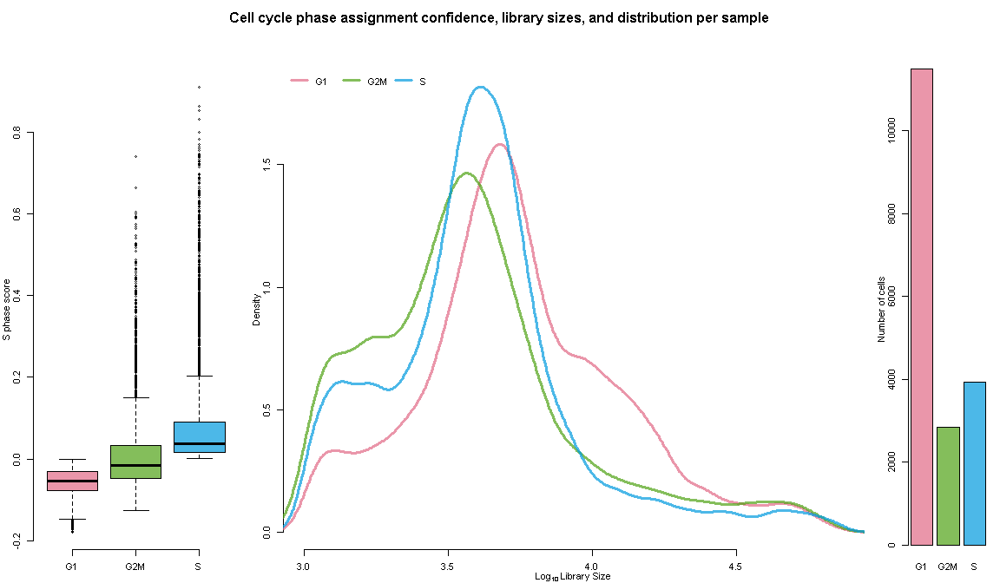

``` r
# Create the composite plot and save it
p <- recordPlot()
save_png(p, "plots/cell_cycle_analysis.png", width = 9, height = 8, res = 300)
```

Evaluating effects of mitochondrial expression

``` r
# Check quartile values for mitoRatio, we will use this variable later to mitigate the unwanted sources of variation in the dataset
summary(seurat@meta.data$mitoRatio)

# Turn mitoRatio into a categorical variable based on quartile values
seurat@meta.data$mitoFr <- cut(
  seurat@meta.data$mitoRatio,
  breaks=c(-Inf, 0.015, 0.025, 0.045, Inf),
  labels=c("Low","Medium","Medium high", "High")
  )
```

## **Step 5. Data scaling**

``` r
# Scaling
seurat <- ScaleData(seurat, verbose = FALSE)
```

After scoring the cells for cell cycle, we would like to **determine
whether cell cycle is a major source of variation in our dataset using
PCA**

``` r
#  PCA
seurat <- RunPCA(seurat, verbose = FALSE)
```

``` r
# Plot the PCA colored by cell cycle phase
p1 <- DimPlot(seurat,
              reduction = "pca",
                    group.by= "Phase", pt.size = 0.1) + NoLegend()

p2 <- DimPlot(seurat,
                      reduction = "pca",
                      group.by= "Phase",
                      split.by= "Phase", pt.size = 0.1)
 
p <- p1 + p2 + plot_layout(widths = c(1, 2)); p
```

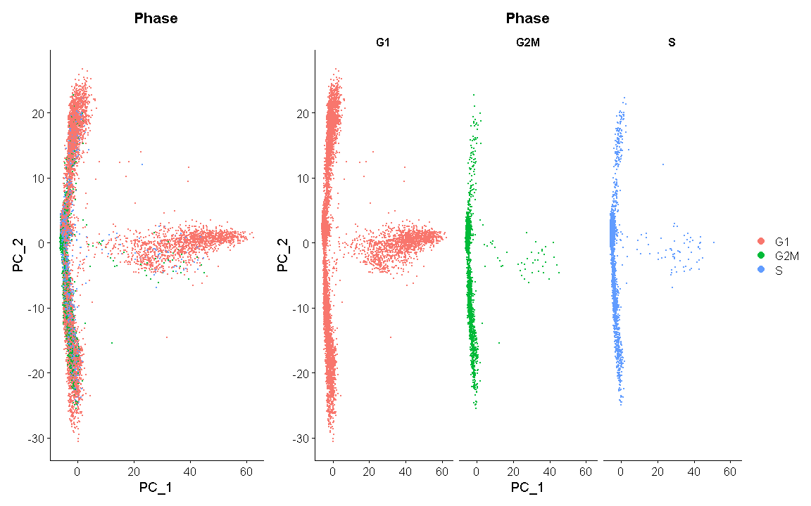

``` r
save_png(p, "plots/pca_cell_cycle_phase.png", width = 12, height = 5, res = 300)
```

For mitochondrial expression:

``` r
# Plot the PCA colored by mitochondrial expression
p1 <- DimPlot(seurat,
        reduction = "pca",
        group.by= "mitoFr", pt.size = 0.1)
        
p2 <- DimPlot(seurat,
        reduction = "pca",
        group.by= "mitoFr",
        split.by= "mitoFr", pt.size = 0.1) 
        
p <- (p1 + p2) & NoLegend() + plot_layout(widths = c(1, 2)); p
```

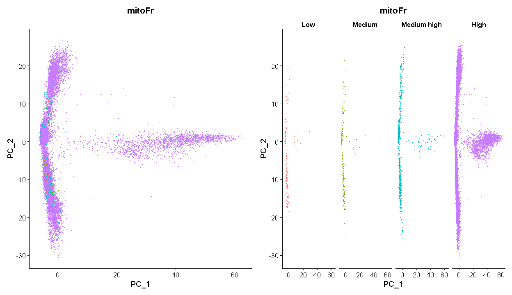

``` r
save_png(p, "plots/pca_mitochondrial_expression.png", width = 12, height = 5, res = 600)
```

``` r
# Split seurat object by group
seurat <- SplitObject(seurat, split.by = "sample"); seurat
```

    ## $normal
    ## An object of class Seurat 
    ## 20124 features across 4245 samples within 1 assay 
    ## Active assay: RNA (20124 features, 2000 variable features)
    ##  3 layers present: counts, data, scale.data
    ##  1 dimensional reduction calculated: pca
    ## 
    ## $tumor
    ## An object of class Seurat 
    ## 20124 features across 14032 samples within 1 assay 
    ## Active assay: RNA (20124 features, 2000 variable features)
    ##  3 layers present: counts, data, scale.data
    ##  1 dimensional reduction calculated: pca

### SCTransform

One problem of doing the typical log-normalization is that is introduces
the [zero-inflation
artifact](https://genomebiology.biomedcentral.com/articles/10.1186/s13059-019-1874-1)
into the scRNA seq data. To better resolve this issue, Hafemeister and
Satija introduced an R package sctransform, which uses a regularized
negative binomial regression model to normalize scRNA-seq data.

There are several important considerations when using SCTransform:

- 1- The method is relatively slow.

- 2- Unlike standard procedures that normalize each cell independently,
  SCTransform uses information from the entire dataset during
  normalization. This can make it challenging to compare results across
  different datasets, as normalized expression values become
  dataset-specific.

- 3- The method uses random sampling to accelerate computation, which
  introduces slight variability in results each time it is run, even on
  the same data.

This single command performs normalization, scaling, and identification
of highly variable features, effectively replacing steps 3-5 in the
standard workflow.

``` r
set.seed(1234)
# then normalize by SCTansform
for (i in 1:length(seurat)) {
  
  seurat[[i]] <- SCTransform(seurat[[i]], 
                                vars.to.regress = c("mitoRatio", 
                                                    "S.Score", 
                                                    "G2M.Score"),
                                verbose = FALSE)
}; gc()
```

## Step 6. Integration

``` r
options(future.globals.maxSize = 10000 * 1024^2)
set.seed(1234)
# Select most variable features (nfeatures = 3000)
integ_features <- SelectIntegrationFeatures(object.list = seurat, 
  nfeatures = 3000)

# Prepare SCT object for integration
seurat <- PrepSCTIntegration(object.list = seurat, 
  anchor.features = integ_features, verbose = FALSE)


# Find integration anchors-pairs of cells from different datasets that are most similar.
integ_anchors <- FindIntegrationAnchors(object.list = seurat,
  normalization.method = "SCT",
  anchor.features = integ_features, verbose = FALSE)

# Integrate the datasets. Actually merges the datasets into one shared expression matrix, correcting batch effects while preserving biological variation.The result is seurat, which you can now use for downstream steps like PCA, clustering, and differential expression.
seurat <- IntegrateData(anchorset = integ_anchors, 
                                new.assay.name = "integrated",
                                normalization.method = "SCT",
                                verbose = FALSE)
```

### Step 7. Linear dimensionality reduction using principal component analysis (PCA)

#### **Run PCA**

The benefit of doing such a dimension reduction includes but is not
limited to:

- 1- The data becomes much more compact so that computation becomes much
  faster.

- 2- As scRNA-seq data is intrinsically sparse, summarizing measurements
  of related features greatly enhances the signal robustness.

``` r
# Run PCA
seurat <- RunPCA(object = seurat, verbose = F)
```

``` r
# Visualize cell distribution across samples using PCA
p <- DimPlot(seurat, reduction = "pca", split.by = "sample")
p
```

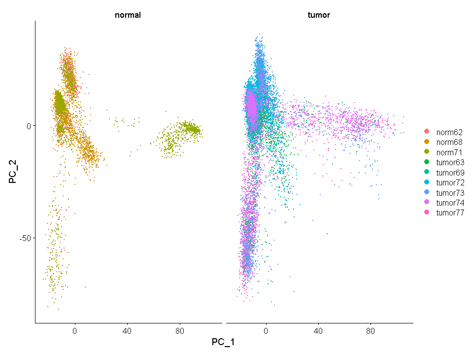

``` r
save_png(p, "plots/pca_by_sample.png", width = 10, height = 7.5, res = 300)
```

#### Identify significant PCs

Not all PCs carry meaningful biological information; typically, only the
top PCs capture the relevant variation that distinguishes cell
populations. To improve efficiency, Seurat employs a truncated PCA
approach, which by default computes just the first 50 PCs.

``` r
# Printing out the most variable genes driving PCs
print(x = seurat[["pca"]], dims = 1:10, nfeatures = 5)
```

    ## PC_ 1 
    ## Positive:  CALD1, IGFBP7, SPARC, COL1A2, COL3A1 
    ## Negative:  IL7R, SRGN, HLA-DRA, CXCR4, CD74 
    ## PC_ 2 
    ## Positive:  KRT18, PHGR1, KRT8, LGALS4, TFF3 
    ## Negative:  HLA-DRA, LYZ, TYROBP, CD74, HLA-DRB1 
    ## PC_ 3 
    ## Positive:  IL7R, CXCR4, CD69, CD3D, KLRB1 
    ## Negative:  KRT18, PHGR1, KRT8, TFF3, LGALS4 
    ## PC_ 4 
    ## Positive:  SRGN, SOD2, NAMPT, CXCL8, TIMP1 
    ## Negative:  HLA-DRA, CD74, HLA-DPB1, HLA-DPA1, HLA-DQA1 
    ## PC_ 5 
    ## Positive:  PECAM1, VWF, RAMP2, HSPG2, CLEC14A 
    ## Negative:  LUM, DCN, FBLN1, CXCL14, COL6A3 
    ## PC_ 6 
    ## Positive:  CCL5, GZMA, NKG7, C1QA, GZMB 
    ## Negative:  CD79A, MS4A1, BASP1, IGKC, SOD2 
    ## PC_ 7 
    ## Positive:  PLCG2, CD79A, MS4A1, HLA-DRA, IGKC 
    ## Negative:  FTL, RPL8, RPL7, RPL30, S100A11 
    ## PC_ 8 
    ## Positive:  PLCG2, VCAN, A2M, CFD, ELF3 
    ## Negative:  MT2A, MT1E, MT1X, PLA2G2A, MT1M 
    ## PC_ 9 
    ## Positive:  FTH1, CXCL14, VCAN, BASP1, IL32 
    ## Negative:  PLCG2, ELF3, FCGBP, JUN, MUC2 
    ## PC_ 10 
    ## Positive:  CCL5, HSPA1A, NKG7, GZMA, SOX4 
    ## Negative:  FABP1, PLAC8, TFF1, KRT20, PHGR1

``` r
# To determine how many Pcs should be considered for clustering:
# Plot the elbow plot
p <- ElbowPlot(object = seurat, ndims = 50)
p
```

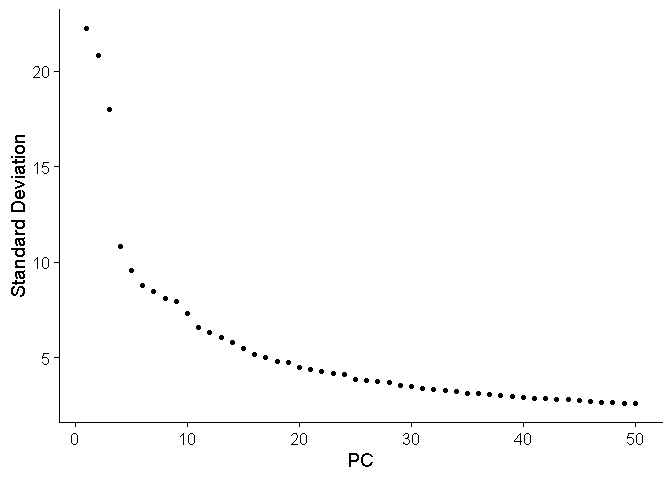

``` r
save_png(p, "plots/pca_elbow_plot.png", width = 8, height = 6, res = 600)
```

The goal is to understand how much of the total “information” or
“variation” in your dataset is captured by each Principal Component
(PC). Since PCs are ordered (PC1 captures the most variation, PC2 the
second most, and so on), we want to know how much each one contributes
so we can decide how many to keep.

Percent variance explained per PC

- Takes the standard deviation of each PC (from your PCA results)
- Divides by the total standard deviation
- Multiplies by 100 → gives % variance explained by each PC.

``` r
pct <- seurat[["pca"]]@stdev / sum(seurat[["pca"]]@stdev) * 100


# Calculate cumulative percents for each PC
cumu <- cumsum(pct)

# Determine which PC exhibits cumulative percent greater than 90% and % variation associated with the PC as less than 5
co1 <- which(cumu > 90 & pct < 5)[1]; co1
```

    ## [1] 40

``` r
# Determine the difference between variation of PC and subsequent PC
co2 <- sort(which((pct[1:length(pct) - 1] - pct[2:length(pct)]) > 0.1), decreasing = T)[1] + 1

# last point where change of % of variation is more than 0.1%.
co2
```

    ## [1] 16

``` r
# Minimum of the two calculation is the optimal number of PC to pick.
optimal_pcs <- min(co1, co2); optimal_pcs
```

    ## [1] 16

Apart from making an unbiased decision, one can also check which genes
are mostly contributing to each of the top PCs . This can be informative
if one knows the genes and the biology of the analyzed sample. It
provides the opportunity to understand the biological implication of
each of the top PCs, so that one can pick those representing useful
information.

``` r
p <- PCHeatmap(seurat, dims = 1:16, cells = 500, balanced = TRUE)
```

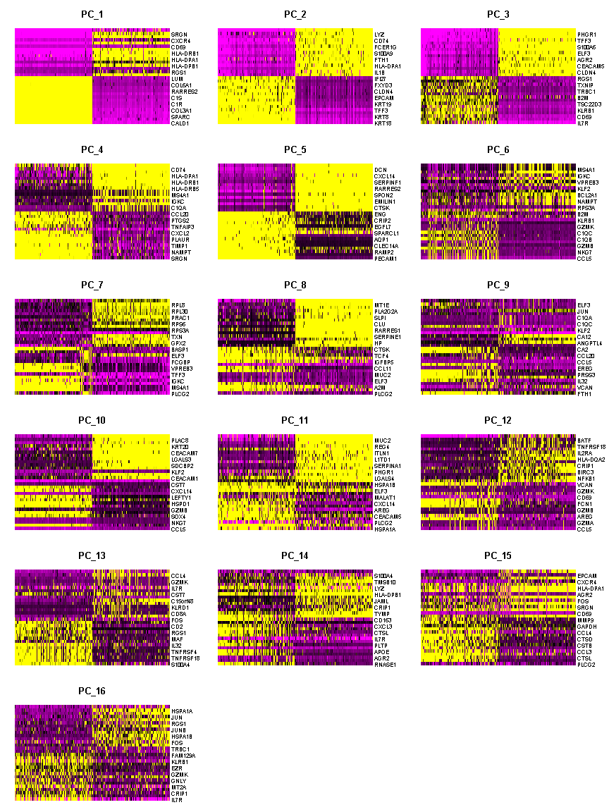

``` r
p
```

    ## NULL

``` r
save_png(p, "plots/pca_heatmap.png", width = 9, height = 12, res = 600)
```

    ## NULL

### Step 8. Non-linear dimension reduction for visualization

``` r
# Run UMAP (Uniform Manifold Approximation and Projection)
seurat <- RunUMAP(seurat,
                  reduction = "pca",
                  dims = 1:40,
                  verbose = F)

# Run tSNE (t-distributed Stochastic Neighbor Embedding)
seurat <- RunTSNE(seurat,
                  reduction = "pca",
                  dims = 1:40, 
                  verbose = F)
gc()
```

``` r
# sample = tumor & normal
p1 <- DimPlot(seurat, reduction = "umap",
              split.by = "sample") + NoLegend()
p2 <- DimPlot(seurat, reduction = "tsne", 
              split.by = "sample") 
p <- p1 + p2 + plot_layout(widths = c(1, 1))
p
```

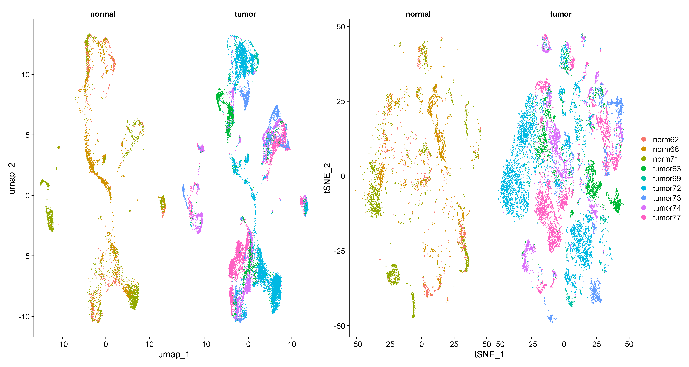

``` r
save_png(p, "plots/umap_tsne_by_sample.png", width = 15, height = 8, res = 600)
```

#### Step 9. Cluster the cells

``` r
DefaultAssay(object = seurat)

set.seed(1234)
# Build the K-nearest neighbor (KNN) graph
seurat <- FindNeighbors(object = seurat, 
                                dims = 1:18, verbose = F)

# Find clusters at multiple resolutions     
seurat <- FindClusters(
  object = seurat,
  resolution = c(0.4, 0.6, 0.8, 1.0, 1.4), 
  verbose = F
  )


Idents(object = seurat) <- "integrated_snn_res.0.4"
```

``` r
p1 <- DimPlot(seurat, reduction = "umap", label = TRUE, 
              label.size = 6) + NoLegend()

p2 <- DimPlot(seurat, reduction = "tsne", label = TRUE, 
              label.size = 6)
p <- p1 + p2 + plot_layout(widths = c(1, 1))
p
```

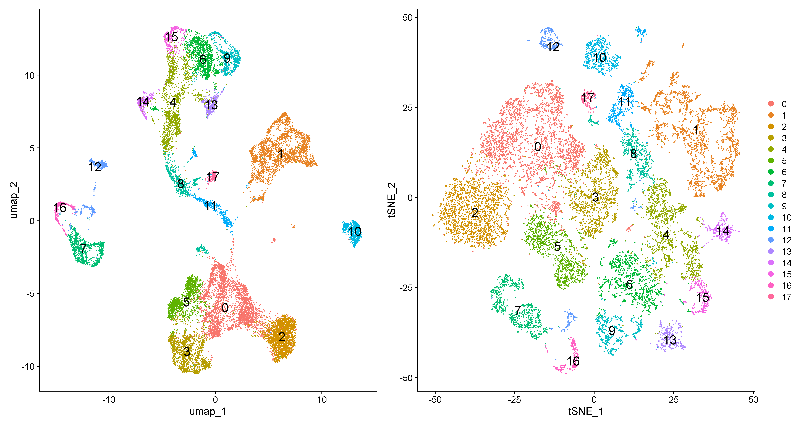

``` r
save_png(p, "plots/umap_tsne_clusters.png", width = 15, height = 8, res = 600)
```

#### Clustering quality control

After clustering, we need to make sure that the assigned clusters are
true representative of biological clusters (cell clusters) not due to
technical or unwanted source of variation (like cell cycle stages).
Also, in this step, we need to identify cell type for each cluster based
on the known cell type markers.

- Segregation of clusters by sample

This code is doing two related things — counting cells in each cluster
per sample, and then visually checking how clusters distribute across
your samples.

``` r
# Count how many cells per cluster per sample
n_cells <- FetchData(seurat,
                     vars = c("ident", "orig.ident")) %>%
        dplyr::count(ident, orig.ident) %>%
        tidyr::spread(ident, n)

# View table
head(n_cells)
```

    ##   orig.ident    0   1    2   3   4  5   6   7   8   9 10  11 12 13  14  15  16
    ## 1 GSM7290762  131  36    6 106 145 11  23  16  19 179 67  19  3 13   2  83  NA
    ## 2 GSM7290763  556 193    1  88 580  7  49  31  57   5 92  30 31  2 330   1  NA
    ## 3 GSM7290768  255  45  193  99 157  8  97   6 338  45 45 265  1  1   8  16  NA
    ## 4 GSM7290769   50  34   46  54  78 NA  65   5  26 121 34  21  3 NA  NA  28  NA
    ## 5 GSM7290771  100 160  468 108  58 36  15 328  14   6 90  14 19  1   1 136 181
    ## 6 GSM7290772 1020  83 1247 239 227  2 877   4 140 221 86 145  4  1  NA  30  NA
    ##   17
    ## 1  8
    ## 2 23
    ## 3 44
    ## 4 11
    ## 5 20
    ## 6 75

``` r
# Barplot of proportion of cells in each cluster by sample
p <- ggplot(seurat@meta.data) +
  geom_bar(aes(x = integrated_snn_res.0.4, fill = sample), position = position_fill()) +
  xlab("Cluster") +
  ylab("Proportion of Cells") +
  scale_fill_manual(values = c("#909100", "#BdB")) +
  theme_classic() +
  theme(axis.text.x = element_text(angle = 45, hjust = 1))

p
```

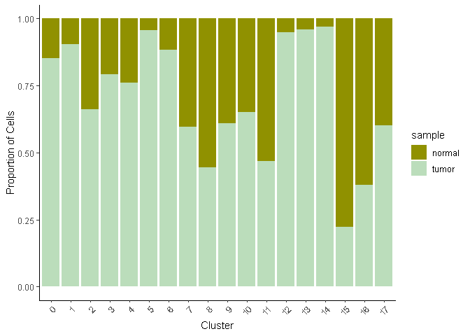

``` r
save_png(p, "plots/cluster_sample_proportions.png", width = 9, height = 6, res = 600)
```

``` r
# UMAP of cells in each cluster by sample
# This would allow us to see condition specific clusters
p1 <- DimPlot(seurat, 
        label = TRUE, reduction = "umap",
        split.by = "sample")
p2 <- DimPlot(seurat, 
        label = TRUE, reduction = "tsne",
        split.by = "sample") 

p <- (p1 + p2) & NoLegend()
p
```

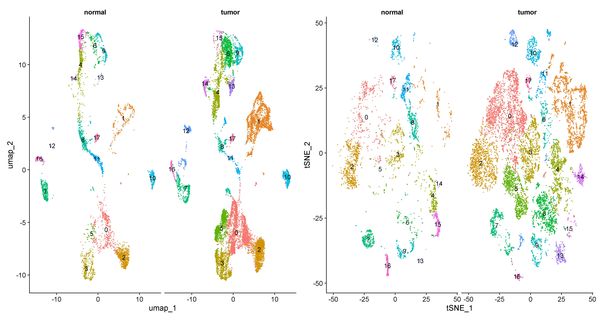

``` r
save_png(p, "plots/umap_tsne_clusters_by_sample.png", width = 15, height = 8, res = 600)
```

``` r
# UMAP visualization split by cell cycle phase
p1 <- DimPlot(seurat, label = TRUE, split.by = "Phase") 

# t-SNE visualization split by cell cycle phase
p2 <- DimPlot(seurat, label = TRUE, reduction = "tsne", split.by = "Phase")

p <- (p1 / p2) & NoLegend()
p
```

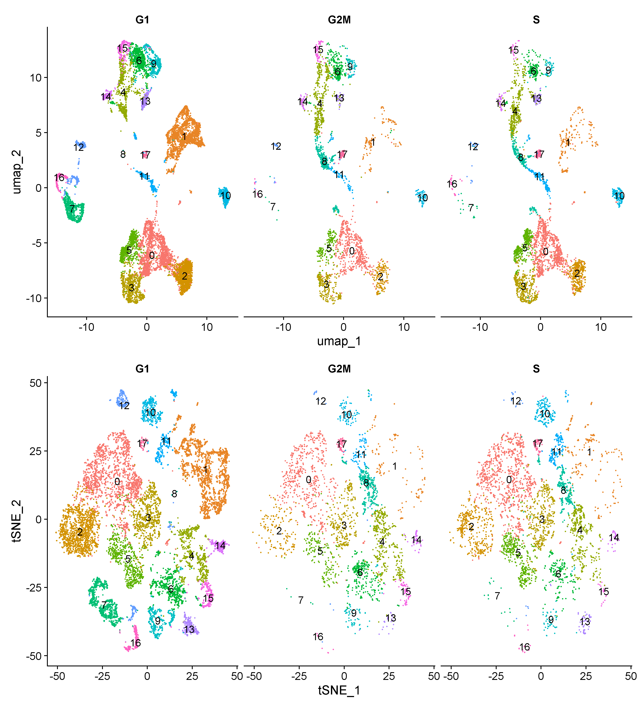

``` r
save_png(p, "plots/umap_tsne_clusters_by_phase.png", width = 10, height = 11, res = 600)
```

- Segregation of clusters by various sources of uninteresting variation

We expect to see a uniform coloring for all variables in all clusters.
Sometimes this is not the case. For here `nUMI` and `nGene` show higher
values is some clusters. We have to watch these clusters and inspect
them in terms of the type of cell therein. So that may explain some of
the variation that we are seeing.

``` r
# Determine metrics to plot present in seurat@meta.data
metrics <-  c("nUMI", "nGene", "S.Score", "G2M.Score", "mitoRatio")

p1 <- FeaturePlot(seurat, 
            reduction = "umap", 
            features = metrics,
            pt.size = 0.4, # adjust cell dot size.
            order = TRUE, # plot higher-expressing cells on top
            min.cutoff = 'q10') 
p2 <- FeaturePlot(seurat, 
            reduction = "tsne", 
            features = metrics,
            pt.size = 0.4, # adjust cell dot size.
            order = TRUE, # plot higher-expressing cells on top
            min.cutoff = 'q10') 

p <- (p1 / p2) & NoLegend()
p
```

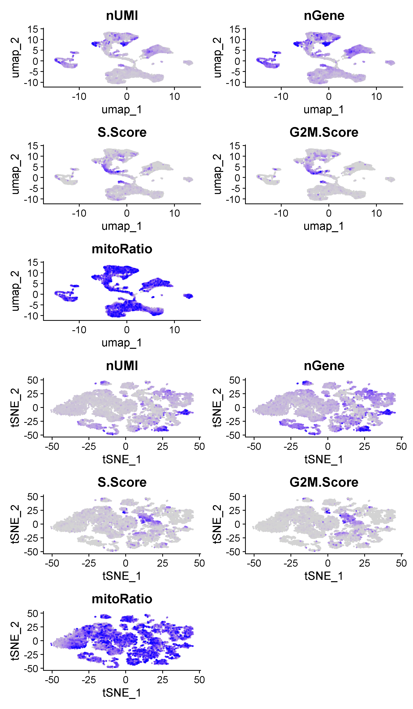

``` r
save_png(p, "plots/umap_tsne_qc_metrics.png", width = 7, height = 14, res = 600)
```

- Exploration of the PCs driving the different clusters

We hope that the defined PCs could separate clusters well.We can see how
the clusters are represented by the different PCs.Then we could look
back at our genes driving this PC to get an idea of what the cell types
might be in each cluster.

``` r
# Defining the information in the seurat object of interest
columns <- c(paste0("PC_", 1:18), "ident", "umap_1", "umap_2")

# Extracting this data from the seurat object
pc_data <- FetchData(seurat, vars = columns)
                     
                     
# Adding cluster label to center of cluster on UMAP
umap_label <- FetchData(seurat, 
                        vars = c("ident", "umap_1", "umap_2"))  %>%
  group_by(ident) %>%
  summarise(x=mean(umap_1), y=mean(umap_2))
```

``` r
# Plotting a UMAP plot for each of the PCs
p <- map(paste0("PC_", 1:18), function(pc){
  ggplot(pc_data, aes(umap_1, umap_2)) +
    geom_point(aes(color=!!sym(pc)), alpha = 0.7) + 
    # aes(color = !!sym(pc))
    scale_color_gradient(guide = "none", 
                         low = "grey90", 
                         high = "blue")  +
    geom_text(data=umap_label, 
              aes(label=ident, x, y)) +
    ggtitle(pc)
}) %>% 
  cowplot::plot_grid(plotlist = .)
p
```

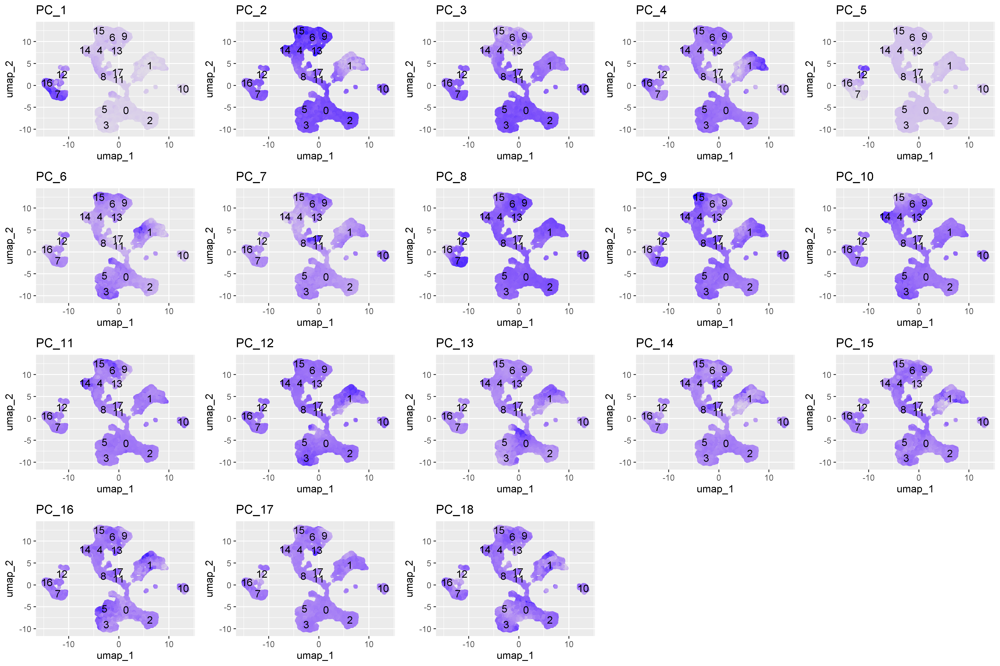

``` r
save_png(p, "plots/umap_by_pc.png", width = 12, height = 10, res = 600)
```

``` r
# Examine PCA results 
print(seurat[["pca"]], dims = 1:5, nfeatures = 5)
```

    ## PC_ 1 
    ## Positive:  CALD1, IGFBP7, SPARC, COL1A2, COL3A1 
    ## Negative:  IL7R, SRGN, HLA-DRA, CXCR4, CD74 
    ## PC_ 2 
    ## Positive:  KRT18, PHGR1, KRT8, LGALS4, TFF3 
    ## Negative:  HLA-DRA, LYZ, TYROBP, CD74, HLA-DRB1 
    ## PC_ 3 
    ## Positive:  IL7R, CXCR4, CD69, CD3D, KLRB1 
    ## Negative:  KRT18, PHGR1, KRT8, TFF3, LGALS4 
    ## PC_ 4 
    ## Positive:  SRGN, SOD2, NAMPT, CXCL8, TIMP1 
    ## Negative:  HLA-DRA, CD74, HLA-DPB1, HLA-DPA1, HLA-DQA1 
    ## PC_ 5 
    ## Positive:  PECAM1, VWF, RAMP2, HSPG2, CLEC14A 
    ## Negative:  LUM, DCN, FBLN1, CXCL14, COL6A3

``` r
# Normalize RNA data for visualization purposes
DefaultAssay(seurat) <- "RNA"
seurat <- NormalizeData(seurat, verbose = F)
# fibroblast markers
p1 <- FeaturePlot(seurat, 
                  reduction = "umap", 
                  features = c("DCN", "THY1", "COL1A2"), 
                  order = TRUE,
                  min.cutoff = 'q10', 
                  label = TRUE) + NoLegend()

p2 <- FeaturePlot(seurat, 
                  reduction = "tsne", 
                  features = c("DCN", "THY1", "COL1A2"), 
                  order = TRUE,
                  min.cutoff = 'q10', 
                  label = TRUE) + NoLegend()

p <- (p1 | p2) & NoLegend()
p
```

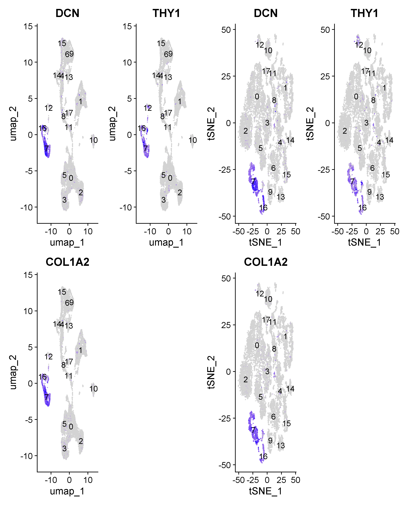

``` r
save_png(p, "plots/fibroblast_markers_umap_tsne.png", width = 10, height = 8, res = 300)
```

## Step 9. Annotate cell clusters

When comparing two biological conditions such as tumor vs normal, the
most effective method for identifying key marker genes is the
**conserved markers approach**.

This technique works as follows: First, for a specific cell cluster,
differential expression analysis is performed *within* the first
condition group. The cells in the target cluster are compared against
all other cells *from the tumor group only* to generate a list of DE
genes. This same process is then repeated *within* the second condition
group (e.g., normal), comparing the same cell cluster against the rest
of the cells in its own normal group.

Finally, the two separate lists of DE genes for that cluster from each
condition are integrated to identify the common, or **conserved**,
markers between them.

``` r
# explecity set the default object to normalized values
DefaultAssay(seurat)
Layers(seurat[["RNA"]])

seurat <- JoinLayers(seurat, assay = "RNA")


levels(Idents(seurat)) 
cluster0_conserved_markers <- FindConservedMarkers(
  seurat,
  ident.1 = 0, 
  grouping.var = "sample",
  only.pos = TRUE,
  logfc.threshold = 0.60,
  min.pct = 0.1, 
  min.cells.group = 3, 
  verbose = F 
)
```

**Identifies genes that are differentially expressed in a specific
cluster across different conditions (e.g., tumor vs normal).**

This analysis looks for genes that are differentially expressed within
each condition first, and then reports those genes that are conserved in
the cluster across all conditions. These genes can help to figure out
the identity for the cluster.

- `ident.1`: this function only evaluates one cluster at a time

- `grouping.var`: the variable (column header) in your metadata which
  specifies the separation of cells into groups

``` r
# Create function to get conserved markers for any given cluster
anno <- readr::read_tsv("data/annotations.tsv")

consM <- function(cluster) {
  message(paste0("Processing cluster ", cluster, "..."))
  
  tryCatch({
    markers <- FindConservedMarkers(
      seurat,
      ident.1 = cluster,
      grouping.var = "sample",
      only.pos = TRUE,
      logfc.threshold = 0.60, 
      verbose = FALSE
    )
    
    message(paste0("Completed cluster ", cluster, " (", nrow(markers), " markers found)"))
    
    markers %>% 
      rownames_to_column(var = "gene") %>% 
      left_join(
        y = unique(anno[, c("gene_name", "description")]),
        by = c("gene" = "gene_name")) %>%
      cbind(cluster_id = cluster, .)
  }, error = function(e) {
    message(paste0("✗ Error in cluster ", cluster, ": ", e$message))
    return(NULL)
  })
}


# conserved_markers <- map_dfr(c(0:20), consM)
# conserved_markers  %>% count(cluster_id)

# readr::write_csv(conserved_markers, "results/conserved_markers.csv")
gc()
```

``` r
# Extract top 10 markers per cluster
top10 <- conserved_markers %>% 
  mutate(avg_fc = (normal_avg_log2FC + tumor_avg_log2FC)/2) %>% 
  group_by(cluster_id) %>% 
  top_n(n = 10, 
        wt = avg_fc)
head(top10)

# readr::write_csv(top10, "results/top10_conserved.csv")
```

Annotate cell type to each cluster :

Accurate cell type annotation is challenging in single cell/nucleus
analysis. Manual annotation suffers from subjectivity while automatic
annotation is limited by (1) incomplete cell type databases and (2) the
fact that canonic markers might not detected. While SingleR is a
semi-automatic algorithm that assigns cell type unbiased by inferring
cell of origin based on reference transcriptomic datasets of pure cell
types, in which user could choose or generate the reference that fits
best with the data set in question.Annotate cell type to each cluster

``` r
library(SingleR)
library(SingleCellExperiment)


ref <- celldex::HumanPrimaryCellAtlasData()

results <- SingleR::SingleR(
  test = as.SingleCellExperiment(seurat), 
  ref = ref, 
  labels = ref$label.main)

seurat$singlr_labels <- results$labels
```

``` r
p1 <- DimPlot(seurat, 
              reduction = 'umap', 
              group.by = 'singlr_labels', 
              label = TRUE,
              label.size = 5,
              repel = TRUE) +
  theme(legend.position = "none")

p2 <- DimPlot(seurat, 
              reduction = 'umap', 
              group.by = 'seurat_clusters', 
              label = TRUE,
              label.size = 5,alpha = 0.8, label.box = T)
p <- (p1 / p2) & NoLegend()
p
```

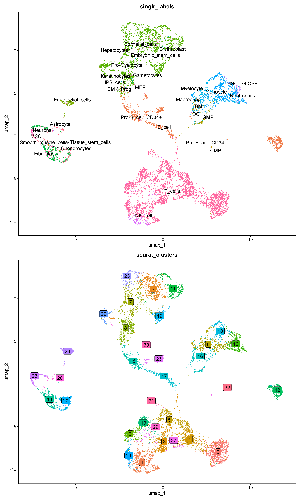

``` r
save_png(p, "plots/singleR_vs_cluster_umap.png", width = 8, height = 10, res = 600)
```

``` r
# Endothelial markers
p1 <- FeaturePlot(seurat, 
            reduction = "umap", 
            features = c("CDH5", "VWF"), 
            order = TRUE,
            min.cutoff = 'q10', 
            label = TRUE)
p2 <- FeaturePlot(seurat, 
            reduction = "tsne", 
            features = c("CDH5", "VWF"), 
            order = TRUE,
            min.cutoff = 'q10', 
            label = TRUE)

p <- (p1 / p2) & NoLegend()
p
```

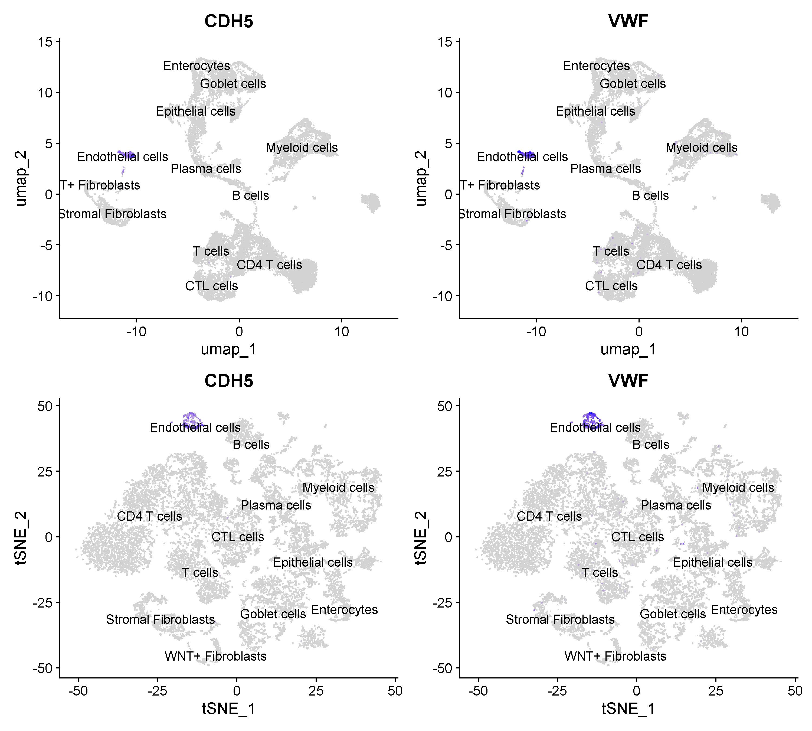

``` r
save_png(p, "plots/endothelial_markers_umap_tsne.png", width = 8, height = 10, res = 300)
```

``` r
# CTL markers
p1 <- FeaturePlot(seurat, 
            reduction = "umap", 
            features = "CD8A", 
            order = TRUE,
            min.cutoff = 'q10', 
            label = TRUE)
p2 <- FeaturePlot(seurat, 
            reduction = "tsne", 
            features = "CD8A", 
            order = TRUE,
            min.cutoff = 'q10', 
            label = TRUE) 

p <- (p1 + p2) & NoLegend()
p
```

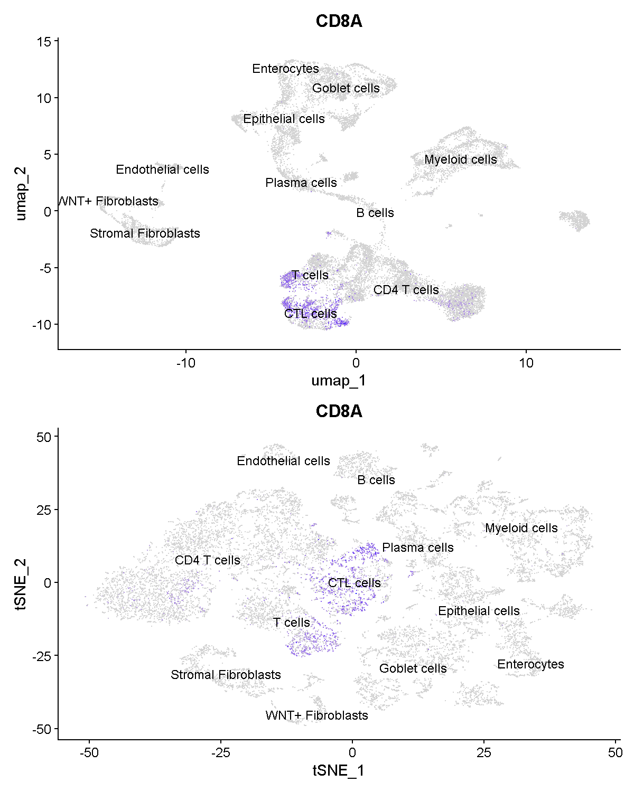

``` r
save_png(p, "plots/cd8a_expression_umap_tsne.png", width = 6, height = 10, res = 600)
```

``` r
# Manual annotation

my_markers <- list(
  "B cells" = c("CD79A", "MS4A1"),
  "Plasma cells" = c("MZB1", "JCHAIN"),
  "T cells" = c("CD3D", "CD3E", "CD3G"),
  "CD4 T cells" = c("CD4", "IL7R"),
  "Cytotoxic T cells" = c("CD8A", "CD8B", "GZMB", "PRF1"),
  "NK cells" = c("NKG7", "GNLY"),
  "Monocytes" = c("CD14", "LYZ"),
  "Macrophages" = c("CD68", "C1QA", "C1QB", "CD163"),
  "cDC2" = c("CLEC10A"),
  "Endothelial" = c("PECAM1" , "VWF", "CDH5", "CLDN5"),
  "Fibroblasts" = c("DCN", "COL1A1", "COL1A2", "LUM", "PDGFRA"),
  "Epithelial" = c("EPCAM", "CDH1", "KRT8", "KRT18"),
  "Myofibroblasts" = c("ACTA2", "TAGLN", "MYL9"),
  "WNT+ Fibroblasts" = c("WNT2B", "WNT5A", "RSPO3"),
  "Enterocytes"=c("FABP1", "CA1", "CA2"),
  "Goblet Cells"=c("MUC2", "TFF3", "SPINK4", "FCGBP")
)

p <- DotPlot(seurat, 
        features = unique(unlist(my_markers)), 
        assay = "RNA") +
  theme(axis.text.x = element_text(angle = 45, hjust=1))

p
```

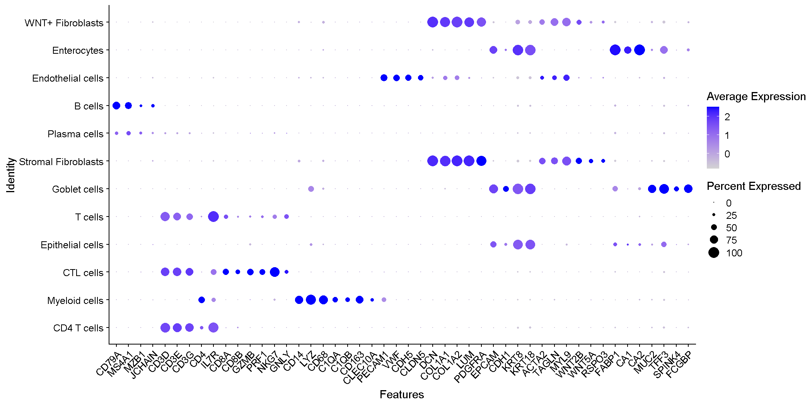

``` r
save_png(p, "plots/celltype_marker_dotplot.png", width = 14, height = 8, res = 600)
```

``` r
c_markers <- unique(unlist(my_markers))
p <- DoHeatmap(seurat, features = c_markers) + NoLegend()

p
```

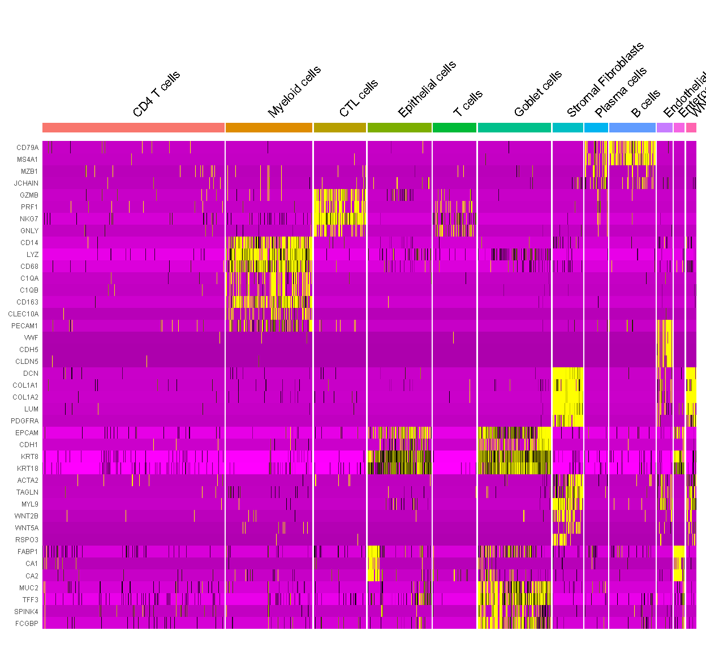

``` r
save_png(p, "plots/celltype_marker_heatmap.png", width = 12, height = 10, res = 600)
```

``` r
new_ident <- setNames(c(
  "0" = "CD4 T cells",
  "1" = "Myeloid cells",      
  "2" = "CD4 T cells",  
  "3" = "CTL cells",  
  "4" = "Epithelial cells",  
  "5" = "T cells",            
  "6" = "Goblet cells",       
  "7" = "Stromal Fibroblasts",
  "8" = "Plasma cells",       
  "9" = "Goblet cells",       
  "10" = "B cells",           
  "11" = "B cells",           
  "12" = "Endothelial cells", 
  "13" = "Goblet cells",      
  "14" = "Epithelial cells",  
  "15" = "Enterocytes",       
  "16" = "WNT+ Fibroblasts",  
  "17" = "B cells"),
  levels(seurat))


seurat <- RenameIdents(seurat, new_ident)

p1 <- DimPlot(object = seurat, 
        reduction = "tsne", 
        label = TRUE,
        label.size = 4,
        repel = TRUE)


p2 <- DimPlot(object = seurat, 
        reduction = "umap", 
        label = TRUE,
        label.size = 4,
        repel = TRUE)
p <- p1/p2; p
```

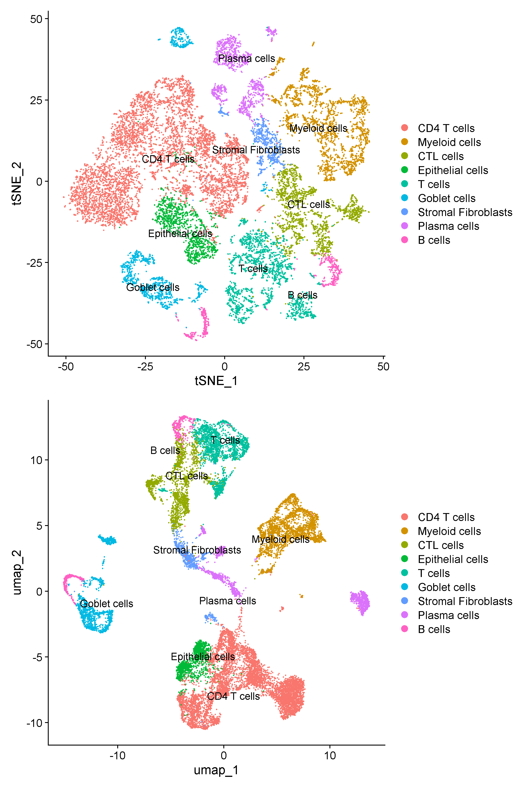

``` r
save_png(p, "plots/annotated_celltypes_umap_tsne.png", width = 8, height = 12, res = 600)
```

``` r
levels(Idents(seurat))
table(Idents(seurat))

t_cells <- WhichCells(seurat, idents = c("CD4 T cells",
                                         "CD4 T cells",
                                         "CTL cells",
                                         "T cells"))
t_cells <- subset(seurat, Cells = t_cells)
t_cells <- SCTransform(t_cells)
# These are now standard steps in the Seurat workflow for visualization and clustering
t_cells <- RunPCA(t_cells, verbose = FALSE)
t_cells <- RunUMAP(t_cells, dims = 1:20, verbose = FALSE)
t_cells <- FindNeighbors(t_cells, dims = 1:20, verbose = FALSE)
t_cells <- FindClusters(t_cells, 
                            resolution = 0.5,
                            verbose = FALSE)
```

``` r
p <- DimPlot(t_cells, label = TRUE) + NoLegend()
p
```

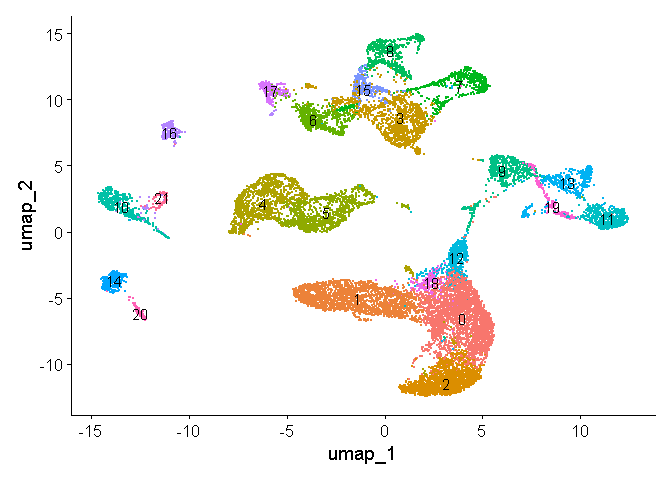

``` r
save_png(p, "plots/tcell_subclustering_umap.png", width = 8, height = 6, res = 600)
```

``` r
p <- VlnPlot(t_cells, 
        features = c("CD3D", "CD3E", "CD3G", 
                     "CD4", "IL7R", 
                     "NKG7" , "GNLY",
                     "CD8A", "CD8B", "GZMB", "PRF1"), 
        pt.size = 0.2, 
        ncol = 3)
p
```

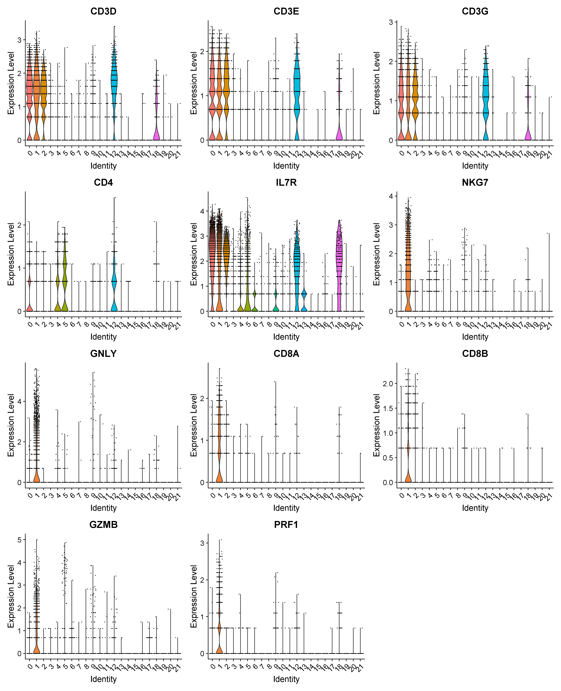

``` r
save_png(p, "plots/tcell_marker_violin.png", width = 12, height = 10, res = 600)
```

``` r
t_markers <- FindAllMarkers(t_cells, only.pos = TRUE, min.pct = 0.25, logfc.threshold = 0.25)

readr::write_csv(t_markers, "results/tcell_markers.csv")
```

``` r
top10 <- t_markers %>% 
  group_by(cluster) %>% 
  top_n(10, avg_log2FC)

p <- DoHeatmap(t_cells, features = top10$gene) + NoLegend()
p
```

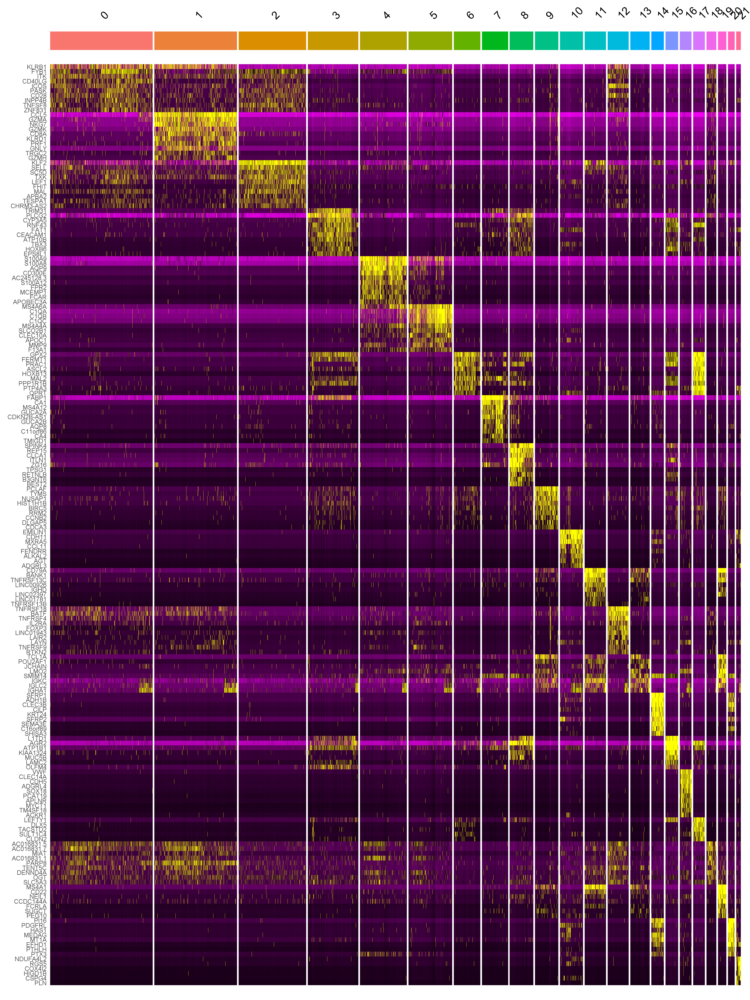

``` r
save_png(p, "plots/tcell_subcluster_heatmap.png", width = 15, height = 12, res = 600)
```

``` r
t_sub <- list(
  # Core Lineage
  CD4 = c("CD4", "IL7R"),
  CD8 = c("CD8A", "CD8B"),
  NK = c("NKG7", "GNLY", "NCAM1", "KLRF1"),
  
  # Functional States
  activated = c("CD69", "CD70", "ICOS"),
  naive = c("CCR7", "SELL", "LEF1"),
  exhausted = c("PDCD1", "CTLA4", "TIGIT", "LAG3", "HAVCR2"),
  
  # CD4+ Subsets
  Th1 = c("IFNG", "TBX21"),
  Th2 = c("GATA3"),
  Treg = c("FOXP3", "IL2RA", "IL10", "CTLA4")
)


cluster_ids <- unique(t_markers$cluster)

anno_res <- lapply(cluster_ids, function(cl){
  cl_markers <- t_markers %>% 
    filter(cluster == cl) %>% 
    pull(gene)
  
  scores <- sapply(t_sub, function(ref_genes){
    sum(ref_genes %in% cl_markers)
  })
  
  best_match <- names(which.max(scores))
  
  data.frame(cluster = cl, 
             best_match = best_match, 
             match_score = max(scores))
})

anno_res <- do.call(rbind, anno_res)


t_cells$subtype <- plyr::mapvalues(
  Idents(t_cells), 
  from = anno_res$cluster, 
  to   = anno_res$best_match
)
```

``` r
p1 <- DimPlot(t_cells, 
        group.by = "subtype", 
        reduction = "umap",
        label = TRUE, 
        repel = TRUE)

p2 <- DimPlot(t_cells, 
        group.by = "subtype", 
        reduction = "tsne",
        label = TRUE, 
        repel = TRUE)

p <- (p1 + p2) & NoLegend()
p
```

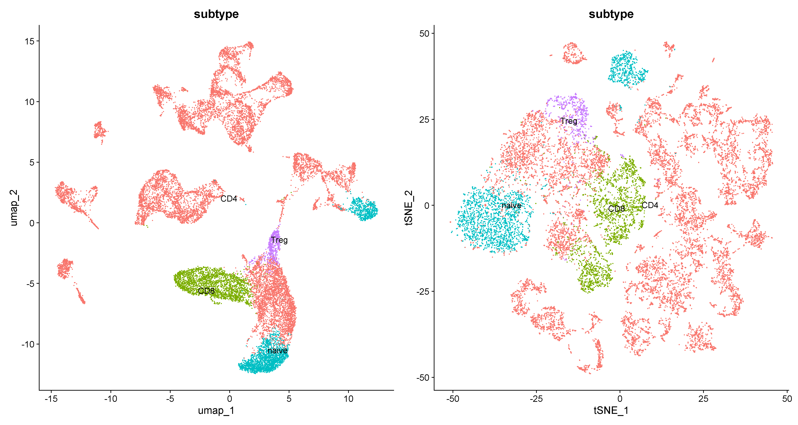

``` r
save_png(p, "plots/tcell_subtypes_umap_tsne.png", width = 12, height = 5, res = 600)
```

``` r
sessionInfo()
```

    ## R version 4.5.1 (2025-06-13 ucrt)
    ## Platform: x86_64-w64-mingw32/x64
    ## Running under: Windows 11 x64 (build 26100)
    ## 
    ## Matrix products: default
    ##   LAPACK version 3.12.1
    ## 
    ## locale:
    ## [1] LC_COLLATE=English_United States.utf8 
    ## [2] LC_CTYPE=English_United States.utf8   
    ## [3] LC_MONETARY=English_United States.utf8
    ## [4] LC_NUMERIC=C                          
    ## [5] LC_TIME=English_United States.utf8    
    ## 
    ## time zone: Asia/Tehran
    ## tzcode source: internal
    ## 
    ## attached base packages:
    ## [1] stats     graphics  grDevices utils     datasets  methods   base     
    ## 
    ## other attached packages:
    ##  [1] Matrix_1.7-3       patchwork_1.3.1    lubridate_1.9.4    forcats_1.0.0     
    ##  [5] stringr_1.5.1      dplyr_1.1.4        purrr_1.1.0        readr_2.1.5       
    ##  [9] tidyr_1.3.1        tibble_3.3.0       ggplot2_3.5.2      tidyverse_2.0.0   
    ## [13] Seurat_5.3.0       SeuratObject_5.1.0 sp_2.2-0          
    ## 
    ## loaded via a namespace (and not attached):
    ##   [1] RColorBrewer_1.1-3     rstudioapi_0.17.1      jsonlite_2.0.0        
    ##   [4] magrittr_2.0.3         spatstat.utils_3.1-5   farver_2.1.2          
    ##   [7] rmarkdown_2.29         vctrs_0.6.5            ROCR_1.0-11           
    ##  [10] spatstat.explore_3.5-2 htmltools_0.5.8.1      sctransform_0.4.2     
    ##  [13] parallelly_1.45.1      KernSmooth_2.23-26     htmlwidgets_1.6.4     
    ##  [16] ica_1.0-3              plyr_1.8.9             plotly_4.11.0         
    ##  [19] zoo_1.8-14             igraph_2.1.4           mime_0.13             
    ##  [22] lifecycle_1.0.4        pkgconfig_2.0.3        R6_2.6.1              
    ##  [25] fastmap_1.2.0          fitdistrplus_1.2-4     future_1.67.0         
    ##  [28] shiny_1.11.1           digest_0.6.37          colorspace_2.1-1      
    ##  [31] tensor_1.5.1           RSpectra_0.16-2        irlba_2.3.5.1         
    ##  [34] labeling_0.4.3         progressr_0.15.1       spatstat.sparse_3.1-0 
    ##  [37] timechange_0.3.0       httr_1.4.7             polyclip_1.10-7       
    ##  [40] abind_1.4-8            mgcv_1.9-3             compiler_4.5.1        
    ##  [43] bit64_4.6.0-1          withr_3.0.2            fastDummies_1.7.5     
    ##  [46] qs_0.27.3              R.utils_2.13.0         MASS_7.3-65           
    ##  [49] tools_4.5.1            lmtest_0.9-40          httpuv_1.6.16         
    ##  [52] future.apply_1.20.0    goftest_1.2-3          R.oo_1.27.1           
    ##  [55] glue_1.8.0             nlme_3.1-168           promises_1.3.3        
    ##  [58] grid_4.5.1             Rtsne_0.17             cluster_2.1.8.1       
    ##  [61] reshape2_1.4.4         generics_0.1.4         gtable_0.3.6          
    ##  [64] spatstat.data_3.1-8    tzdb_0.5.0             R.methodsS3_1.8.2     
    ##  [67] data.table_1.17.8      RApiSerialize_0.1.4    hms_1.1.3             
    ##  [70] stringfish_0.17.0      spatstat.geom_3.5-0    RcppAnnoy_0.0.22      
    ##  [73] ggrepel_0.9.6          RANN_2.6.2             pillar_1.11.0         
    ##  [76] vroom_1.6.5            spam_2.11-1            RcppHNSW_0.6.0        
    ##  [79] later_1.4.3            splines_4.5.1          lattice_0.22-7        
    ##  [82] bit_4.6.0              survival_3.8-3         deldir_2.0-4          
    ##  [85] tidyselect_1.2.1       miniUI_0.1.2           pbapply_1.7-4         
    ##  [88] knitr_1.50             gridExtra_2.3          scattermore_1.2       
    ##  [91] xfun_0.53              matrixStats_1.5.0      stringi_1.8.7         
    ##  [94] lazyeval_0.2.2         yaml_2.3.10            evaluate_1.0.4        
    ##  [97] codetools_0.2-20       cli_3.6.5              RcppParallel_5.1.10   
    ## [100] uwot_0.2.3             xtable_1.8-4           reticulate_1.43.0     
    ## [103] Rcpp_1.1.0             globals_0.18.0         spatstat.random_3.4-1 
    ## [106] png_0.1-8              spatstat.univar_3.1-4  parallel_4.5.1        
    ## [109] dotCall64_1.2          listenv_0.9.1          viridisLite_0.4.2     
    ## [112] scales_1.4.0           ggridges_0.5.6         crayon_1.5.3          
    ## [115] rlang_1.1.6            cowplot_1.2.0


